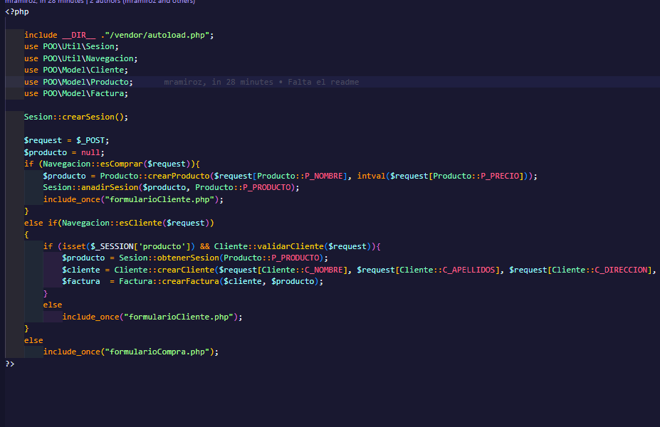
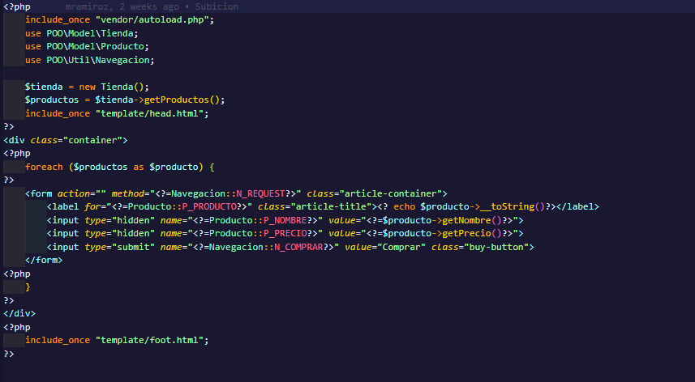
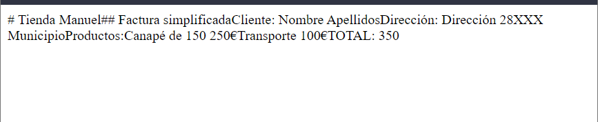
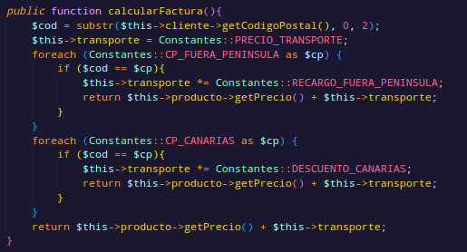
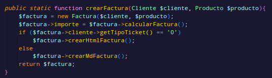
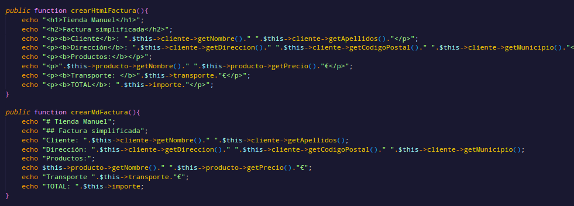
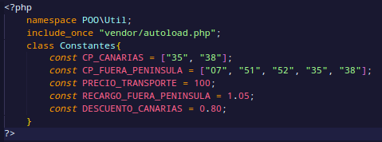
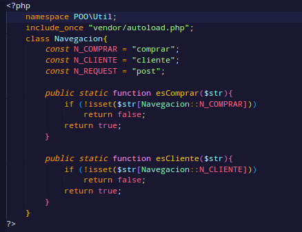
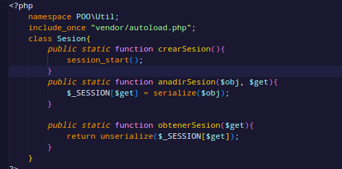

# Prototipo
### Formularios de compra

### Formularios de cliente

### Ticket HTML

### Ticket MD

# Diagrama de navegación
# Diseño de la solución

He creado una arquitectura en el que separo las clases por Model y Util, en Model se encuntran Cliente, Factura, Producto y Tienda(contiene todos los productos que van a ser cargados). En util se encuentran Constantes, Navegacion y Sesion. Y fuera en la raiz de src se encuentran el index y los formularios.

Para cargar las clases utilizo la utilidad autoload de composer, para que lo realice de forma automática.
### Index.php

Este es el index donde se cargan los formularios y se realiza la navegación. Primero comenzamos creando la sesión, para posteriormente guardar el producto seleccionado, además de determinar el metodo de request en este caso es POST y creando la varible producto para que se pueda utlizar en los distintos scopes.

Comprobamos si el botón de comprar ha sido pulsado entonces se crea el producto seleccionado y se añade a la sesión y se redirige al formulario para registrar al cliente. Si el botón no está pulsado se vulve a cargar el formulario de compra.

Si se encuentra en el formulario de cliente y ha pulsado el botón de enviar, se obtiene de la sesion actual el producto, se crea el cliente y se genera la factura. Si el botón no está pulsado se vuelve a cargar el formulario de cliente.

### Formulario de compra

Para obtener los objetos de la tienda se crea un objeto tipo Tienda y se cargan los productos, luego para crear el formulario se hace un foreach de todos los productos y crea cada cajita de formulario para cada producto.
### Formulario de cliente

Es un formulario sencillo en el que se pide el nombre, apellidos, dirección, municipio, codigo postal, el tipo de ticket si lo quiere en HTML o en Markdown y el botón de enviar.

### Cliente.php
La clase cliente se compone de sus atributos que son los dados en el fomulario anterior, un constructor, los getters y dos métodos. Uno para crear un nuevo cliente y otro para comprobar si el cliente es valido al rellenar todos los datos del formulario.

### Producto.php
La clase producto se compone de sus atributos, nombre y precio, de getters, el constructor, un to string y un método para crear un nuevo producto.

### Tienda.php
Contiene un metodo que crea todos los productos de la tienda y un atributo para guardar todos los productos. Esta clase sera utilizada para crear el formulario de la compra.

### Factura.php
La clase Factura contiene sus atributos en este caso son un objeto de tipo cliente, otro objeto de tipo producto, y dos flotantes uno para el precio del transporte y otro para el importe. Hay un constructor, y distintos métodos.
#### Método para calcular la factura

Dependiendo del codigo postal tiene un precio de transporte u otro, lo que se refleja en el importe final
#### Métodos para crear la factura

Elige el tipo de factura dependiendo de la selección del usuario.
y luego los métodos para crear los dos tipos:

### Constantes.php

Contiene los códigos postales de canarias, fuera de la peninsula, el precio de transporte predeterminado y el recargo y descuento.

### Navegacion.php

Cotiene las constantes de los botones y los métodos para comprobar si se pulsan o no los botones.

### Sesion.php

Clase de sesión muy sencilla para crear una sesión, añadir datos a la sesión y obtener los datos de la sesión.

### Carpeta template
Se encuentran la cabeza y el pie html que se aplican en los formularios y los estilos.