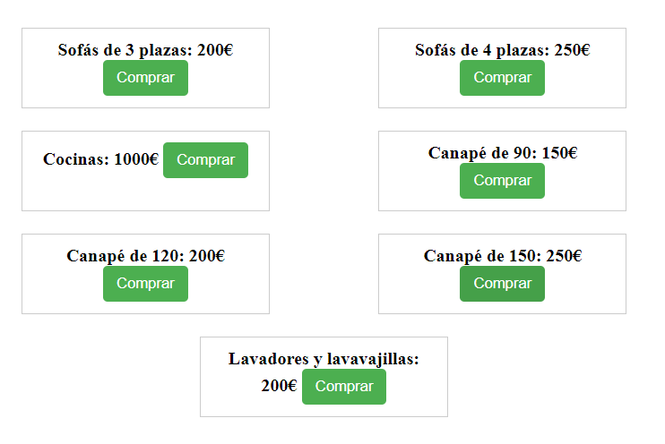
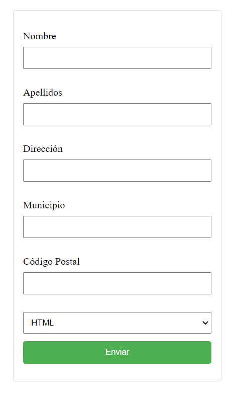
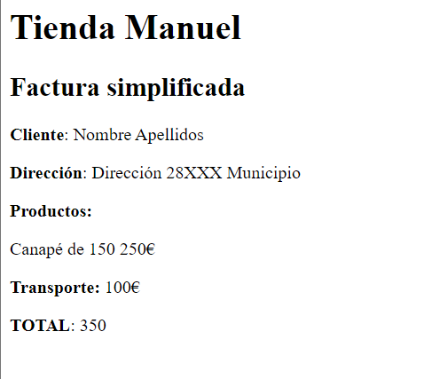
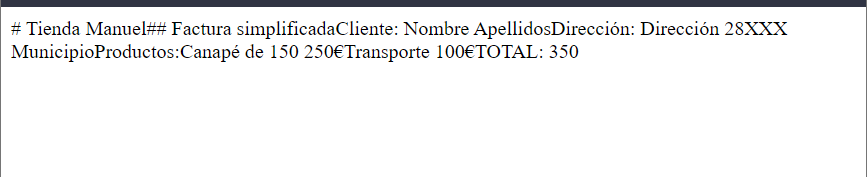
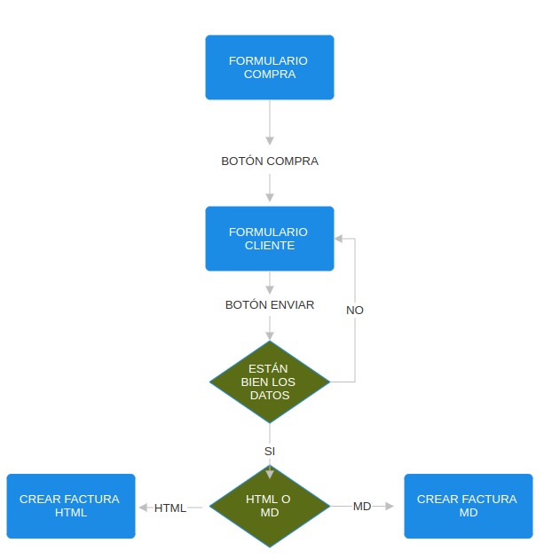
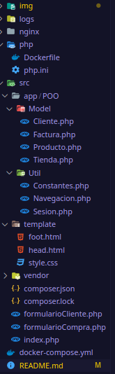

# Prototipo
### Formularios de compra

### Formularios de cliente

### Ticket HTML

### Ticket MD

# Diagrama de navegación

# Diseño de la solución


He creado una arquitectura en el que separo las clases por Model y Util, en Model se encuntran Cliente, Factura, Producto y Tienda(contiene todos los productos que van a ser cargados). En util se encuentran Constantes, Navegacion y Sesion. Y fuera en la raiz de src se encuentran el index y los formularios.

Para cargar las clases utilizo la utilidad autoload de composer, para que lo realice de forma automática.
### Index.php
```php
<?php

	include __DIR__ ."/vendor/autoload.php";
	use POO\Util\Sesion;
	use POO\Util\Navegacion;
	use POO\Model\Cliente;
	use POO\Model\Producto;
	use POO\Model\Factura;

	Sesion::crearSesion();
	
	$request = $_POST;
	$producto = null;
	if (Navegacion::esComprar($request)){
		$producto = Producto::crearProducto($request[Producto::P_NOMBRE], intval($request[Producto::P_PRECIO]));
		Sesion::anadirSesion($producto, Producto::P_PRODUCTO);
		include_once("formularioCliente.php");
	}
	else if(Navegacion::esCliente($request))
	{
		if (isset($_SESSION['producto']) && Cliente::validarCliente($request)){
			$producto = Sesion::obtenerSesion(Producto::P_PRODUCTO);
			$cliente = Cliente::crearCliente($request[Cliente::C_NOMBRE], $request[Cliente::C_APELLIDOS], $request[Cliente::C_DIRECCION], $request[Cliente::C_MUNICIPIO], $request[Cliente::C_CODIGO_POSTAL], $request[Cliente::C_TIPO_TICKET]);
			$factura  = Factura::crearFactura($cliente, $producto);
		}
		else
			include_once("formularioCliente.php");
	}
	else
		include_once("formularioCompra.php");
?>
```

Este es el index donde se cargan los formularios y se realiza la navegación. Primero comenzamos creando la sesión, para posteriormente guardar el producto seleccionado, además de determinar el metodo de request en este caso es POST y creando la varible producto para que se pueda utlizar en los distintos scopes.

Comprobamos si el botón de comprar ha sido pulsado entonces se crea el producto seleccionado y se añade a la sesión y se redirige al formulario para registrar al cliente. Si el botón no está pulsado se vulve a cargar el formulario de compra.

Si se encuentra en el formulario de cliente y ha pulsado el botón de enviar, se obtiene de la sesion actual el producto, se crea el cliente y se genera la factura. Si el botón no está pulsado se vuelve a cargar el formulario de cliente.

### Formulario de compra
```php
<?php
	include_once "vendor/autoload.php";
	use POO\Model\Tienda;
	use POO\Model\Producto;
	use POO\Util\Navegacion;

	$tienda = new Tienda();
	$productos = $tienda->getProductos();
	include_once "template/head.html";
?>
<div class="container">
<?php
	foreach ($productos as $producto) {
?>
	<form action="<?php echo htmlspecialchars($_SERVER['PHP_SELF'], ENT_QUOTES, "UTF-8" );?>" method="<?=Navegacion::N_REQUEST?>" class="article-container">
		<label for="<?=Producto::P_PRODUCTO?>" class="article-title"><? echo $producto->__toString()?></label>
		<input type="hidden" name="<?=Producto::P_NOMBRE?>" value="<?=$producto->getNombre()?>">
		<input type="hidden" name="<?=Producto::P_PRECIO?>" value="<?=$producto->getPrecio()?>">
		<input type="submit" name="<?=Navegacion::N_COMPRAR?>" value="Comprar" class="buy-button">
	</form>
<?php
	}
?>
</div>
<?php
	include_once "template/foot.html";
?>
```

Para obtener los objetos de la tienda se crea un objeto tipo Tienda y se cargan los productos, luego para crear el formulario se hace un foreach de todos los productos y crea cada cajita de formulario para cada producto.
### Formulario de cliente
```php
<?php
	include_once "vendor/autoload.php";
	use POO\Util\Navegacion;
	use POO\Model\Cliente;
	include_once "template/head.html";
?>
<div class="container">
	<form action="<?php echo htmlspecialchars($_SERVER['PHP_SELF'], ENT_QUOTES, "UTF-8" );?>" method="<?=Navegacion::N_REQUEST?>" class="login-form">
		<p>
			<label for="<?=Cliente::C_NOMBRE?>">Nombre</label>
			<input type="text" name="<?=Cliente::C_NOMBRE?>">
		</p>
		<p>
			<label for="<?=Cliente::C_APELLIDOS?>">Apellidos</label>
			<input type="text" name="<?=Cliente::C_APELLIDOS?>">
		</p>
		<p>
			<label for="<?=Cliente::C_DIRECCION?>">Dirección</label>
			<input type="text" name="<?=Cliente::C_DIRECCION?>">
		</p>
		<p>
			<label for="<?=Cliente::C_MUNICIPIO?>">Municipio</label>
			<input type="text" name="<?=Cliente::C_MUNICIPIO?>">
		</p>
		<p>
			<label for="<?=Cliente::C_CODIGO_POSTAL?>">Código Postal</label>
			<input type="text" name="<?=Cliente::C_CODIGO_POSTAL?>">
		</p>
		<select name="<?=Cliente::C_TIPO_TICKET?>" id="<?=Cliente::C_TIPO_TICKET?>">
			<option value="0">HTML</option>
			<option value="1">MarkDown</option>
		</select>
		<input type="submit" name="<?=Navegacion::N_CLIENTE?>">
	</form>
</div>
<?php
	include_once "template/foot.html";
?>
```

Es un formulario sencillo en el que se pide el nombre, apellidos, dirección, municipio, codigo postal, el tipo de ticket si lo quiere en HTML o en Markdown y el botón de enviar.

### Cliente.php
La clase cliente se compone de sus atributos que son los dados en el fomulario anterior, un constructor, los getters y dos métodos. Uno para crear un nuevo cliente y otro para comprobar si el cliente es valido al rellenar todos los datos del formulario.
### Producto.php
La clase producto se compone de sus atributos, nombre y precio, de getters, el constructor, un to string y un método para crear un nuevo producto.

### Tienda.php
Contiene un metodo que crea todos los productos de la tienda y un atributo para guardar todos los productos. Esta clase sera utilizada para crear el formulario de la compra.

### Factura.php
La clase Factura contiene sus atributos en este caso son un objeto de tipo cliente, otro objeto de tipo producto, y dos flotantes uno para el precio del transporte y otro para el importe. Hay un constructor, y distintos métodos.
#### Método para calcular la factura
```php
	public function calcularFactura(){
		$cod = substr($this->cliente->getCodigoPostal(), 0, 2);
		$this->transporte = Constantes::PRECIO_TRANSPORTE;
		foreach (Constantes::CP_FUERA_PENINSULA as $cp) {
			if ($cod == $cp){
				$this->transporte *= Constantes::RECARGO_FUERA_PENINSULA;
				foreach (Constantes::CP_CANARIAS as $cp2) {
					if ($cod == $cp2){
						$this->transporte *= Constantes::DESCUENTO_CANARIAS;
						return $this->producto->getPrecio() + $this->transporte;
					}
				}
				return $this->producto->getPrecio() + $this->transporte;
			}
		}
		return $this->producto->getPrecio() + $this->transporte;
	}
```

Dependiendo del codigo postal tiene un precio de transporte u otro, lo que se refleja en el importe final
#### Métodos para crear la factura
```php

	public static function crearFactura(Cliente $cliente, Producto $producto){
		$factura = new Factura($cliente, $producto);
		$factura->importe = $factura->calcularFactura();
		if ($factura->cliente->getTipoTicket() == '0')
			$factura->crearHtmlFactura();
		else
			$factura->crearMdFactura();
		return $factura;
	}
```

Elige el tipo de factura dependiendo de la selección del usuario.
y luego los métodos para crear los dos tipos:

```php
	public function crearHtmlFactura(){
		echo "<h1>Tienda Manuel</h1>";
		echo "<h2>Factura simplificada</h2>";
		echo "<p><b>Cliente</b>: ".$this->cliente->getNombre()." ".$this->cliente->getApellidos()."</p>";
		echo "<p><b>Dirección</b>: ".$this->cliente->getDireccion()." ".$this->cliente->getCodigoPostal()." ".$this->cliente->getMunicipio()."</p>";
		echo "<p><b>Productos:</b></p>";
		echo "<p>".$this->producto->getNombre()." ".$this->producto->getPrecio()."€</p>";
		echo "<p><b>Transporte: </b>".$this->transporte."€</p>";
		echo "<p><b>TOTAL</b>: ".$this->importe."</p>";
	}

	public function crearMdFactura(){
		echo "# Tienda Manuel";
		echo "## Factura simplificada";
		echo "Cliente: ".$this->cliente->getNombre()." ".$this->cliente->getApellidos();
		echo "Dirección: ".$this->cliente->getDireccion()." ".$this->cliente->getCodigoPostal()." ".$this->cliente->getMunicipio();
		echo "Productos:";
		echo $this->producto->getNombre()." ".$this->producto->getPrecio()."€";
		echo "Transporte ".$this->transporte."€";
		echo "TOTAL: ".$this->importe;
	}

```

### Constantes.php
```php
<?php
	namespace POO\Util;
	include_once "vendor/autoload.php";
	class Constantes{
		const CP_CANARIAS = ["35", "38"];
		const CP_FUERA_PENINSULA = ["07", "51", "52", "35", "38"];
		const PRECIO_TRANSPORTE = 100;
		const RECARGO_FUERA_PENINSULA = 1.05;
		const DESCUENTO_CANARIAS = 0.80;
	}
?>
```

Contiene los códigos postales de canarias, fuera de la peninsula, el precio de transporte predeterminado y el recargo y descuento.

### Navegacion.php
```php
<?php
	namespace POO\Util;
	include_once "vendor/autoload.php";
	class Navegacion{
		const N_COMPRAR = "comprar";
		const N_CLIENTE = "cliente";
		const N_REQUEST = "post";

		public static function esComprar($str){
			if (!isset($str[Navegacion::N_COMPRAR]))
				return false;
			return true;
		}

		public static function esCliente($str){
			if (!isset($str[Navegacion::N_CLIENTE]))
				return false;
			return true;
		}
	}
?>
```

Cotiene las constantes de los botones y los métodos para comprobar si se pulsan o no los botones.

### Sesion.php
```php
<?php
    namespace POO\Util;
    include_once "vendor/autoload.php";
    class Sesion{
        public static function crearSesion(){
            session_start();
        }
        public static function anadirSesion($obj, $get){
            $_SESSION[$get] = serialize($obj);
        }

        public static function obtenerSesion($get){
            return unserialize($_SESSION[$get]);
        }
    }
?>
```

Clase de sesión muy sencilla para crear una sesión, añadir datos a la sesión y obtener los datos de la sesión.

### Carpeta template
Se encuentran la cabeza y el pie html que se aplican en los formularios y los estilos.